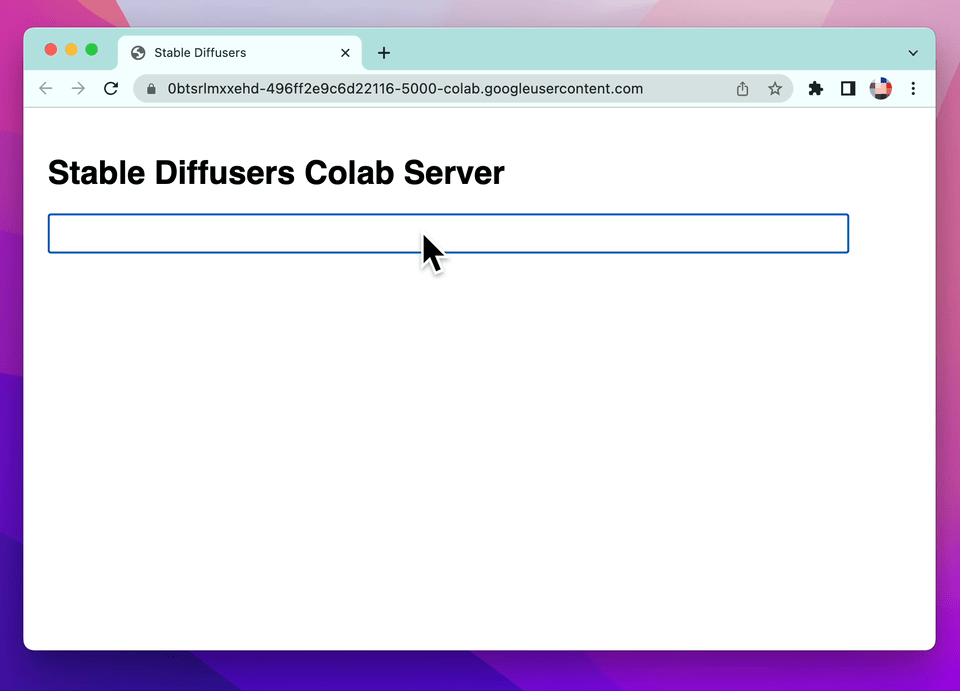

# Stable Diffusion Server on Colab

## How To Use

1. Obtain Huggingface token
2. Open [Colaboratry notebook](https://colab.research.google.com/github/motemen/stablediffusion-server-on-colab/blob/main/Stable_Diffusion_Server_on_Colab.ipynb)
  * Select GPU
  * Fill Huggingface token in
3. Run and wait for server to start
4. Click "localhost:5000" link to open new tab
